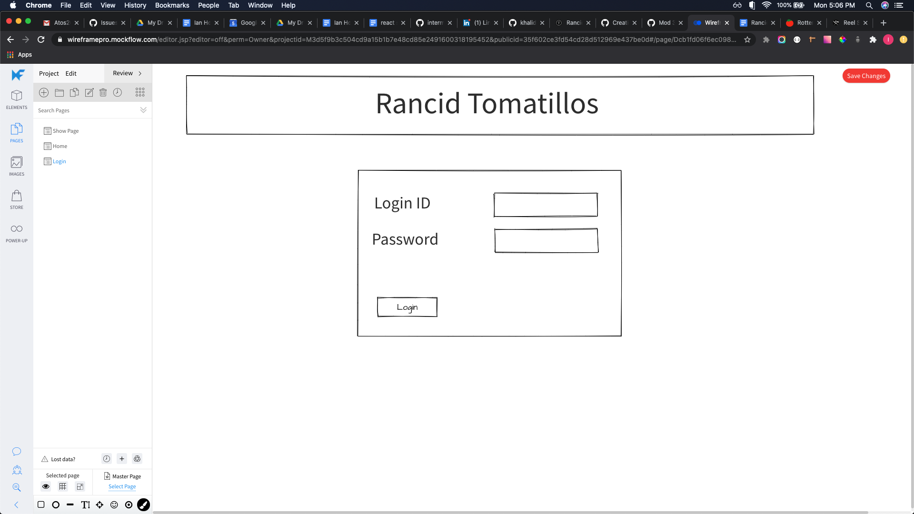
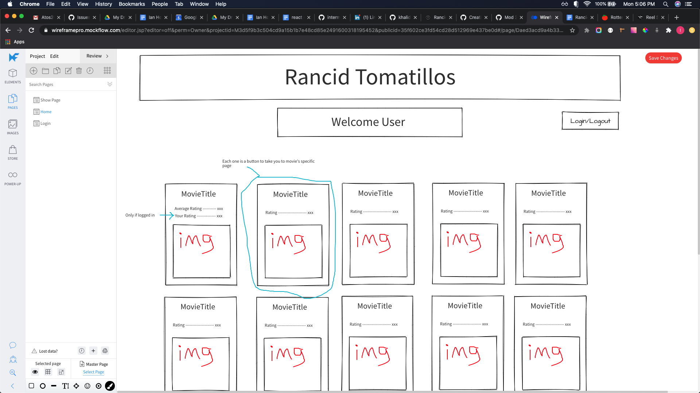
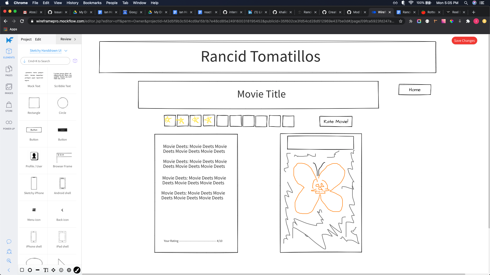
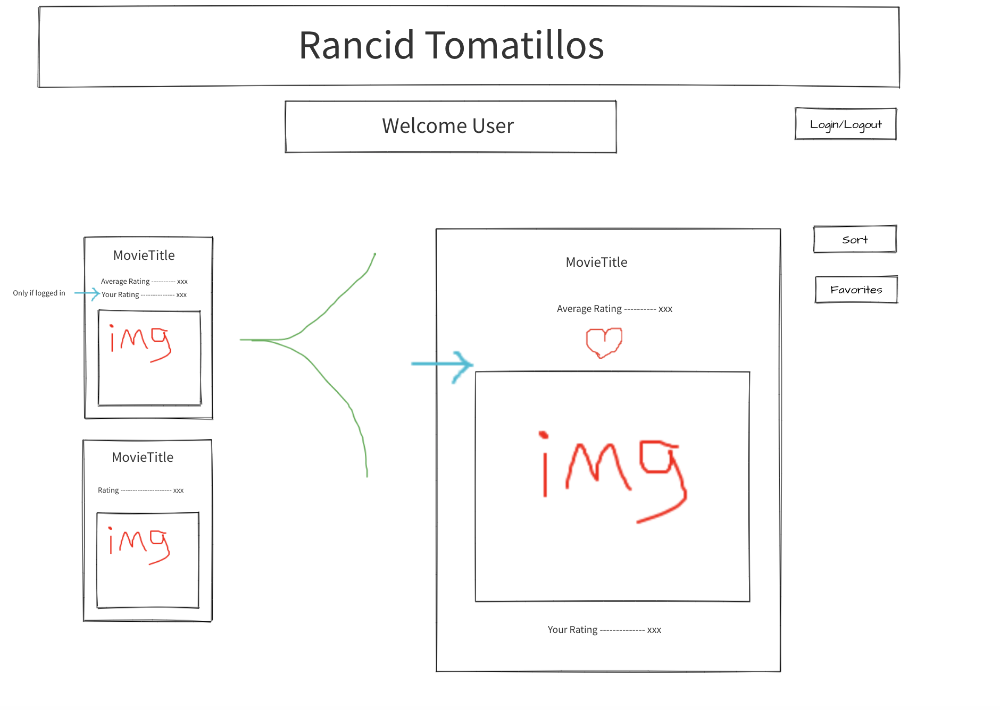
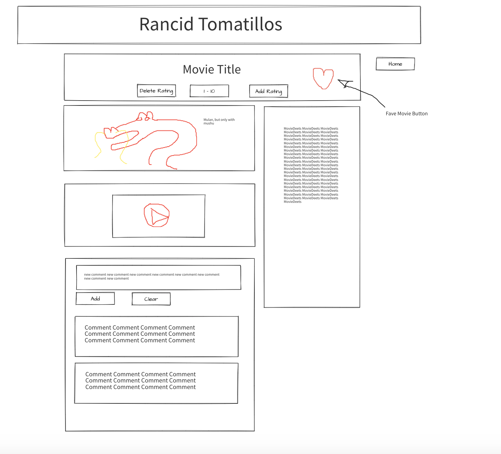

[![Contributors][contributors-shield]](https://github.com/Atos20/Rancid-Tomatillos/graphs/contributors)
[![Forks][forks-shield]](https://github.com/Atos20/Rancid-Tomatillos/network/members)
[![Issues][issues-shield]](https://github.com/Atos20/Rancid-Tomatillos/issues)

## Rancid Tomatillos __*group project*_

### Contributors 

Orlando Murcio [@Atos20](https://github.com/Atos20)
Ian Holladay [@holladayian](https://github.com/holladayian)

## About

Rancid-Tomatillos is a movie rating app, akin to some popular movie rating sites out there. With this app a user will be able to view a list of movies and their average ratings. Upon clicking a movie "card", a user will by Redirected to a movie ShowPage where more specific detail about the movie will be present, along with trailers to the movie and comments people have left about said movie. This app also features the ability for a user to log in. With this implementation, a user will also gain access to rate movies (and see their ratings affect the movies!), like and filter movies, and leave comments on them as well. 

## Breakdown of Goals

* Build an application of React architecture
* User React Router to create a multipage experience
* Run unit and integrations tests on components
* Test asynchronous functionality with the React Testing Library
* Practice professional GitHub workflow

#### Technologies used:

    - React
    - React Router
    - JSX
    - ECMAScript 6 
    - ESLint
    - TDD with Jest
    - VSCode 
    - git / Version control
    - SCSS / SASS
    - API Fetch

## Wins

  * Use of functional and class components
  * Use of the `this.state`
  * Ability to lift-up the state from components
  * Wireframe
  * Passing down props to child components
  * Implementation of `react-router`
  * Use of `react-player`
  * Used of project board `issues`, `labels` and `tickets` 

## Future Goals

  * Better organiziation of `scss` file 
  * Granular commits 
  * Smaller PR's
  * Run-through video of the project
  * Finalize `like`, `unlike`, and `remove` comment functionality
  * Add mixins and variables to `SCSS` files
  * Close existing issues, 'tickets'

## Challenges

    - Express.js
    - Testing `async` functionality
    - Controlled `form` compoenets

## Links to this project can be found:

Project Page
[Link to the our project incease you get lost!](https://github.com/Atos20/Rancid-Tomatillos)

Backend Server
[link to Microservice](https://github.com/Atos20/Rancind-tomatillos-microserver)

Project Spec/Rubric
[Link to the rubric we based this off of!](https://frontend.turing.io/projects/module-3/rancid-tomatillos-v2.html)

## In Action

#### Take 1

- Welcome

When the application run, it request the information about all movies within the `componentDidMount` method that runs even before the `App` render on the page. This way we have all the information availabe to display. 

 The user can see the pplication logo as well as a button to login, to go abck to home and all the movie cards that display information about each movie.

  

  #### Take 2
- Login as a user

When the user inputs the following crendntial, `name` 'diana', `email`'diana@turing@io', and `password` '111111'. The user is greeted with a welcomin message that shows the user that has logged in succesfully.

  

   #### Take 3
- Rate a movie

The user can only reate a movie after it has logged in.The rating option is available to the user only after clickin on a movie card, this action directs the user to the `MoviePage` which displays more in depth details about the movie as well as more option to interact with.

The raiting functionality located underneath the movie title, allows the user to rate a movie by using the dropdown menu and chossing a rate that ranges from 1 to 10. This personlized 

  

   #### Take 4
- Sorting movies by rating

The viwer has the opportunity to interact with the applcation even if hasn't logged into the application. by the `All movies` title the user can select from the dropdown menu the options of `descending` or `ascending` to filter the movies.

  

   #### Take 5
- Display Movie Page with trailer

The user or viwer can click on any movie card and when doing so the home page is directed to the movie page containing adittional information about the movie. It also display the all movie trailers associated with the movie that was clicked.

  

   #### Take 6
- Commenting movies

After the user or viwer has been directed to any movie page, at the buttom of the page the user can see the commenting section that allows the user to make a new comment to that specific movie. As a viwer you can only see the comment but you cant interact with the like button.
  

   #### Take 7
- Favoriting movies

After the user has logged in, the user user can favorite movies that will persist even after the user has logged out and logged back into the application.
  

## Set Up

<!-- To interact with the app without cloning / downloading the file, click [here]().  -->

1. On the top right corner of this page, click the **Fork** button.
1. Clone the repository to your computer `git clone <URL>`
1. When you run git clone - git clone [remote-address] [what you want to name the repo]
1. Once you have cloned the repo, change into the directory and install the project dependencies by running `npm install`.
1. Run `npm start` in your terminal. At this point you should be able to interact with the application. Make sure `localhost` is running on port `3000`
1. use the following credentials to log in, user name `diana`, email `diana@turing.io` and password `111111`
1. Like, comment, favorite, watch a movie traile and enjoy. 
1. Enter `control + c` in your terminal to stop the server at any time.

if you would like to contribute to the front-end-side of the project, you can create a PR and send it over.

    - Make sure you are using a PR template
    - if there is not an exixting ticket for the PR make sure you create one
    - if your PR makes reference or closes and existing ticke make sure to add it in your PR

If you would like to work on the back-end-side of the project (which handles favorites and comments) - a repo for the server can be found [here](https://github.com/Atos20/Rancind-tomatillos-microserver). This change will be managed by Orlando Murcio becuase this server is hosted locally and written using `Express.js`

### Microservice

Clone down [this other repo](https://github.com/Atos20/Rancind-tomatillos-microserver)
<!-- Add repo link here  -->

- `cd` into the repo's directory
- run `npm install`
- run `npm start`

This microservice will run on "localhoast:3001".

### Login

Log into the application with the following credentials

UserName: `Diana`

Email: `diana@turing.io`

Password: `111111`

#### Images

##### WireFrames

Login
  

First remdition of Homepage
  

First rendition of MoviePage
  

Second Rendition of Homepage
  

Second Rendition of MoviePage
  

### Project Managers
- [Khalid](https://github.com/BobGu)
- [Leta](https://github.com/BobGu)
<!-- https://www.markdownguide.org/basic-syntax/#reference-style-links -->
[contributors-shield]: https://img.shields.io/github/contributors/jordy1611/whats-cookin-JS-JS-KS.svg?style=flat-square
[contributors-url]: https://github.com/jordy1611/whats-cookin-JS-JS-KS/graphs/contributors
[forks-shield]: https://img.shields.io/github/forks/jordy1611/whats-cookin-JS-JS-KS.svg?style=flat-square
[forks-url]: https://github.com/jordy1611/whats-cookin-JS-JS-KS/network/members
[stars-shield]: https://img.shields.io/github/stars/jordy1611/whats-cookin-JS-JS-KS.svg?style=flat-square 
[stars-url]: https://github.com/jordy1611/whats-cookin-JS-JS-KS/stargazers
[issues-shield]: https://img.shields.io/github/issues/jordy1611/whats-cookin-JS-JS-KS.svg?style=flat-square
[issues-url]: https://github.com/jordy1611/whats-cookin-JS-JS-KS/issues
[license-shield]: https://img.shields.io/github/license/jordy1611/whats-cookin-JS-JS-KS.svg?style=flat-square
[license-url]: https://github.com/jordy1611/whats-cookin-JS-JS-KS/blob/master/LICENSE.txt
[linkedin-shield]: https://img.shields.io/badge/-LinkedIn-black.svg?style=flat-square&logo=linkedin&colorB=555
[linkedin-url]: https://linkedin.com/in/othneildrew
[product-screenshot]: images/screenshot.png